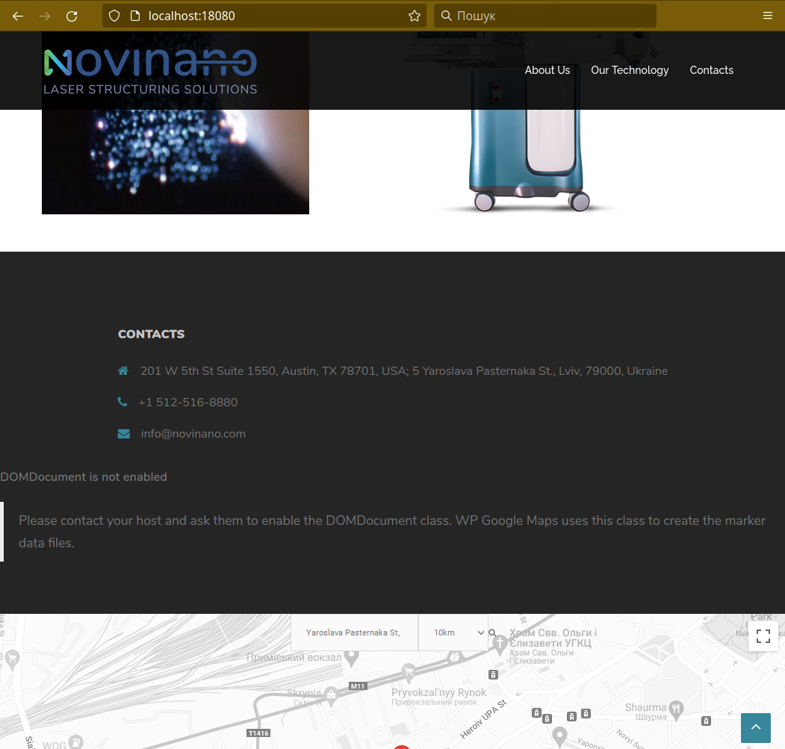

# Vagrant: Створення віртуальної машини та диплой сайту

Найменший шлях без страждань у даному випадку, це диплой віртуальної машини, встановлення всього необхідного і ручне відтворення із бекапу за допомогою наданого інсталятору.

Я не знайшов поки що можливості відновлення бекапу, створенного плагіном **Duplicator**, за допомогою командної строки.

## `Vagrantfile`

```yaml
# -*- mode: ruby -*-
# vi: set ft=ruby :

Vagrant.configure("2") do |config|
  config.vm.box = "generic/ubuntu2004"
  config.vm.define "novinano"
  config.vm.hostname = "novinano"
  config.vm.box_check_update = true
  config.vm.network "forwarded_port", guest: 80, host: 18080, host_ip: "127.0.0.1"
  config.vm.network "public_network", :dev => 'enp6s0'
  config.vm.provider :libvirt do |libvirt|
    libvirt.driver = "kvm"
    libvirt.storage_pool_name = "Media"
  end
  config.vm.provision :shell, path: "bootstrap.sh"
end
```
_Прошу звернути увагу, що для успішного запуска Vagrantfile на іншому хості доведеться змінити мережевий адаптер:_
```config.vm.network "public_network", :dev => 'enp6s0'```

_а також назву пула сховища (можна видалити цей параметр, якщо плануєете використовувати сховище `default`):_
```libvirt.storage_pool_name = "Media"```

## `bootstrap.sh`

Скрипт `bootstrap.sh` робить наступне:
* встановлює необхідні пакунки та залежності;
* створює базу даних, користувача бази даних;
* робить необхідні налаштування, права доступу;
* завантажує бекап та інсталер сайту [NoviNano](https://github.com/mplesha/NoviNano).

```bash
#!/usr/bin/env bash

apt-get update
apt-get install -y mysql-server apache2 php php-mysql php-zip

echo "default-authentication-plugin=mysql_native_password" >> /etc/mysql/mysql.conf.d/mysqld.cnf
systemctl restart mysql

MYSQL_USER=wordpress
MYSQL_PASSWORD=QOV8L6JT2CHWDhpv
MYSQL_HOST=localhost
MYSQL_DB=mt
mysql -u root -e "CREATE DATABASE $MYSQL_DB;"
mysql -u root -e "CREATE USER $MYSQL_USER@$MYSQL_HOST IDENTIFIED WITH mysql_native_password BY '$MYSQL_PASSWORD';"
mysql -u root -e "GRANT ALL ON $MYSQL_DB.* TO $MYSQL_USER@$MYSQL_HOST;"

rm -fr /var/www/html/*
chgrp www-data /var/www/html
chmod g+w /var/www/html
cd /var/www/html
sudo -u www-data wget https://github.com/mplesha/NoviNano/releases/download/v1.0/20180706_novinano_mt_b2a03d4e0cbc53e87026180706071957_installer.php
sudo -u www-data wget https://github.com/mplesha/NoviNano/releases/download/v1.0/20180706_novinano_mt_b2a03d4e0cbc53e87026180706071957_archive.zip

shutdown -r now
```

## Відновлення бекапу

Після закінчення диплою, залишається відвідати адресу:

http://localhost:18080/

запустити _*_installer.php_ та ввести данні для підключення до бази даних:


|            |                    |
| :--------: | :----------------: |
|     Host:  |    `localhost`     |
| Database:  |        `mt`        |
|     User:  |    `wordpress`     |
| Password:  | `QOV8L6JT2CHWDhpv` |

---



