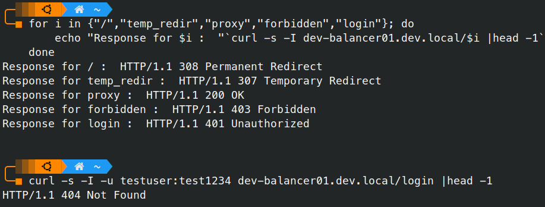

# Web

## Завдання

Install the Nginx server and config it for:

 1. Redirect to medium.com
 2. Redirect to medium.com with another status code
 3. Proxy to whatever you like site from URL/proxy path
 4. Display 4xx from URL/forbidden
 5. Do the basic auth for URL/login
 6. Display the “success” status code
 7. Do load balancing (upstream) with Nginx web server (start two additional servers to balancing)
 8. Provide your Nginx config file and screenshots that demonstrates response pages for items 4, 5, 6 of this task

## Рішення

Усі перелічені позиції представлені у конфігураційному файлі.
```nginx
server {

       listen 80;
       listen [::]:80;

       server_name dev-balancer01 dev-balancer01.dev.local;

       root /var/www/dev-balancer01;
       index index.html;


       location / {
               try_files $uri $uri/ =404;
               # 1. Redirect to medium.com
               return 308 $scheme://medium.com$request_uri;
       }

       # 2. Redirect to medium.com with another status code
       # [implemeted with a 'temp_redir' location]
       location /temp_redir {
               return 307 $scheme://medium.com;
       }

       # 3. Proxy to whatever you like site from URL/proxy path
       # [proxy to kernel.org]
       location /proxy {
               rewrite ^/proxy/?(.*) /$1 break;
               proxy_pass https://kernel.org/;
       }

       # 4. Display 4xx from URL/forbidden
       location /forbidden {
               deny all;
       }

       # 5. Do the basic auth for URL/login
       location /login {
               try_files $uri $uri/ =404;
               auth_basic "Restricted Content";
               auth_basic_user_file /etc/nginx/.htpasswd;
       }

}

```

_Пункт 7 буде продемонстрований у наступних роботах, де буде реалізовуватись розгортання певної інфраструктури із балансуванням._

## Додаткові дії:

### 1. Активуємо конфіг
У цій роботі ми залишемо дефолтний `nginx.conf`, а наш сайт сконфігуруємо окремим файлом `dev-balancer01.dev.local` _(назва серверу та хостнейм будуть збігатися, щоб спростити роботу)_.
Враховуючи, що наш конфіг розташований у `/etc/nginx/sites-available/`, ми маємо його 'активувати', а також деактивуємо дефолтний сайт:

```bash
sudo ln -s /etc/nginx/sites-available/dev-balancer01.dev.local /etc/nginx/sites-enabled/
sudo rm -f /etc/nginx/sites-enabled/default
```

### 2. Cтворюємо користувача та пароль:

Створимо користувача `testuser` із паролем `test1234` _(звісно, що в реальній ситуації ми використаємо більш надійні дані та інший метод додавання)_:
```bash
printf "testuser:$(openssl passwd -apr1 test1234)\n" | sudo tee /etc/nginx/.htpasswd
sudo chmod 640 /etc/nginx/.htpasswd
sudo chgrp www-data /etc/nginx/.htpasswd
```
Не забуваємо перезавантажити конфігурацію після внесених змін:
```bash
sudo systemctl reload nginx
```

## Тестування:

### 1. Опитаємо скриптом усі сконфігуровані локації:
```bash
for i in {"/","temp_redir","proxy","forbidden","login"}; do
    echo "Response for $i :  "`curl -s -I dev-balancer01.dev.local/$i |head -1`
done

Response for / :  HTTP/1.1 308 Permanent Redirect
Response for temp_redir :  HTTP/1.1 307 Temporary Redirect
Response for proxy :  HTTP/1.1 200 OK
Response for forbidden :  HTTP/1.1 403 Forbidden
Response for login :  HTTP/1.1 401 Unauthorized
```

### 2. Перевіримо авторизацію
```bash
curl -s -I -u testuser:test1234 dev-balancer01.dev.local/login |head -1
HTTP/1.1 404 Not Found
```
Отримали `404` замість `403`, отже авторизація пройшла вдало.



---
