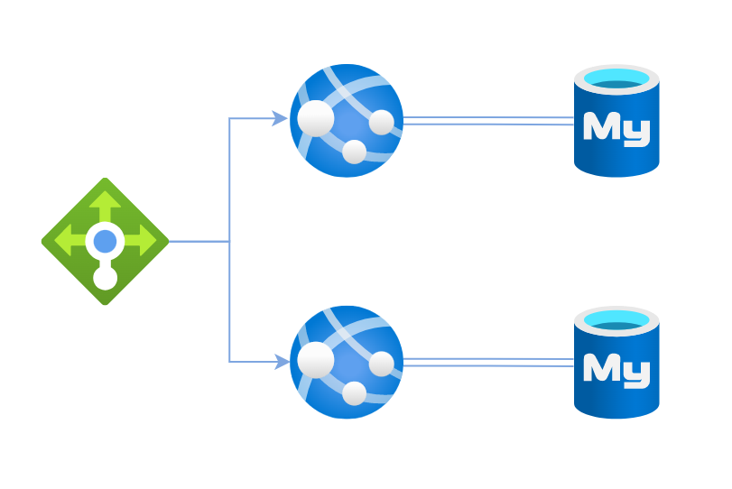
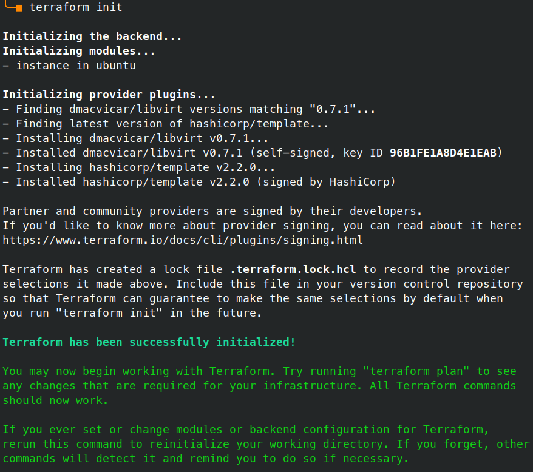
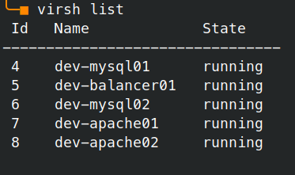
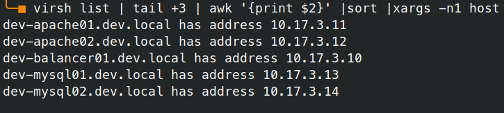
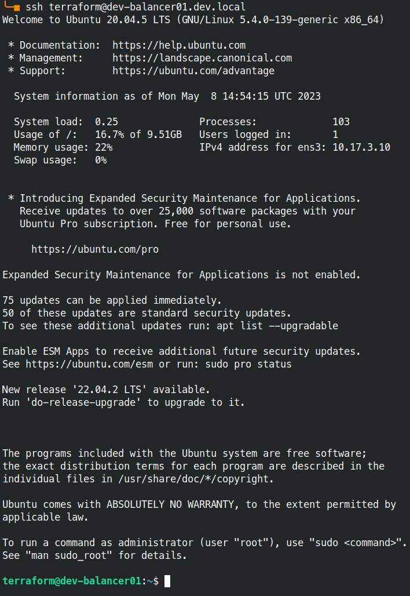

# Terraform

## Задача
Розгортання простої інфраструктури із двох серверів додатків, двох серверів баз даних та одного серверу для балансування трафіку




## Рішення

### Встановлення провайдеру

Для роботи обраний провайдер `livbirt`.

Плагін встановлюється автоматично при виконанні команди

```bash
terraform init
```



### Шаблон віртуальної машини

За основу я узяв шаблон `ubuntu` з репозиторію [vfricou / terraform_libvirt_examples](https://github.com/vfricou/terraform_libvirt_examples), проте він не працює «із коробки», тому його довелось суттєво доробляти (це відображено у комміті 15c5000).


Що реалізовано додатково:
1. Автоматичне призначення статичних IP адрес (без використання DHCP серверу).
2. Автоматичне створення записів DNS (тобто тепер є змога працювати із машинами по мережі за їх хостнеймами).
3. Використання для всіх машин як одиничного значення параметру, так і списку значень (тобто, якщо задати одне значення, воно буде застосовано до усіх віртуальних машин, а якщо вказати список значень, то для кожної машини буде застосоване відповідне значення).

### SSH ключ
Для можливості підключення до віртуальних машин по SSH створимо  ключ
```bash
ssh-keygen -t ed25519 -P "" -C "Terraform" -f Terraform
```
Вміст файлу `Terraform.pub` треба додати у файл `ubuntu/cloud_init/user.yml`.

### Розгортання

#### `main.tf`

Як видно із файлу конфігурації `main.tf` ми розгортаємо 5 віртуальних машин відповідно до нашого завдання.

_! Зверніть увагу на параметр `storage_pool_path` — слід вказати директорію, де у вас достатньо вільного місця для розгортання нашої інфраструктури._

```terraform
terraform {
  required_providers {
    libvirt = {
      source = "dmacvicar/libvirt"
    }
  }
}

module "instance" {
   source = "./ubuntu"
   instance_name = ["dev-balancer01","dev-apache01","dev-apache02","dev-mysql01","dev-mysql02"]
   net_name = "devnet"
   net_domain = "dev.local"
   storage_pool_name = "devproject"
   storage_pool_path = "/mnt/terraform/pools/devproject"
   instance_vcpu = [1,2,2,1,1]
   instance_memory = [1024,1024,1024,1536,1536]
   instance_disk = [10737418240]
  }
```

#### Перевіряємо нашу конфігурацію:
```bash
terraform validate
  Success! The configuration is valid.
```

#### Запускаємо формування:
```bash
terraform apply -auto-approve
```

В результаті маємо отримати повідомлення:
```terraform
Apply complete! Resources: 18 added, 0 changed, 0 destroyed.
```

Переглянути створені ресурси можна командою:
```bash
terraform state list
  module.instance.data.libvirt_network_dns_host_template.records[0]
  module.instance.data.libvirt_network_dns_host_template.records[1]
  module.instance.data.libvirt_network_dns_host_template.records[2]
  module.instance.data.libvirt_network_dns_host_template.records[3]
  module.instance.data.libvirt_network_dns_host_template.records[4]
  module.instance.data.template_file.net_data[0]
  module.instance.data.template_file.net_data[1]
  module.instance.data.template_file.net_data[2]
  module.instance.data.template_file.net_data[3]
  module.instance.data.template_file.net_data[4]
  module.instance.data.template_file.user_data[0]
  module.instance.data.template_file.user_data[1]
  module.instance.data.template_file.user_data[2]
  module.instance.data.template_file.user_data[3]
  module.instance.data.template_file.user_data[4]
  module.instance.libvirt_cloudinit_disk.cloudinit[0]
  module.instance.libvirt_cloudinit_disk.cloudinit[1]
  module.instance.libvirt_cloudinit_disk.cloudinit[2]
  module.instance.libvirt_cloudinit_disk.cloudinit[3]
  module.instance.libvirt_cloudinit_disk.cloudinit[4]
  module.instance.libvirt_domain.instance[0]
  module.instance.libvirt_domain.instance[1]
  module.instance.libvirt_domain.instance[2]
  module.instance.libvirt_domain.instance[3]
  module.instance.libvirt_domain.instance[4]
  module.instance.libvirt_network.devnet
  module.instance.libvirt_pool.terraform
  module.instance.libvirt_volume.rootfs[0]
  module.instance.libvirt_volume.rootfs[1]
  module.instance.libvirt_volume.rootfs[2]
  module.instance.libvirt_volume.rootfs[3]
  module.instance.libvirt_volume.rootfs[4]
  module.instance.libvirt_volume.rootfs_base
```

## Тестування

Переглянемо статус наших машин за допомогою команди `virsh`:
```bash
virsh list
```



### DNS

Перед тим, як перевірити доступність віртуальних машин за їх іменами, додамо деякі параметри на локальному хості:
```bash
NETDEV=`virsh net-info --network devnet | grep Bridge | awk '{print $2}'`
sudo resolvectl domain $NETDEV dev.local
sudo resolvectl dns $NETDEV 10.17.3.1
```
Таким чином хости із домену dev.local будуть шукатись через інтерфейс, створений libvirt.

Перевіримо усі хости простим скриптом:
```bash
virsh list | tail +3 | awk '{print $2}' |sort |xargs -n1 host
```



### SSH

Тепер ми можемо підключитись до будь-якої з віртуалок через SSH.

Спочатку додамо створений раніше ключ до SSH агенту:
```bash
ssh-add Terraform
 Identity added: Terraform (Terraform)
```

Тепер можемо підключатись:
```bash
ssh terraform@dev-balancer01.dev.local
```




---
Ми розгорнули інфраструктуру, як і запланували. Тепер все готово для роботи з [ansible](../HW05/README.md).

---
