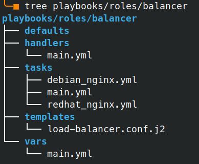

# Ansible

## Задача

В інфраструктурі, яку ми розгорнули на [попередньому етапі](../HW04/README.md) за допомогою Terraform, маємо сконфігурувати:
* два сервери додатків (apache2)
* один сервер балансування (nginx)
* та два сервери баз даних (mysql)

_* Стосовно серверів MySQL, то цьому етапі ми обмежуємося лише встановленням, самі бази даних будемо розгортати у наступних роботах._

## Підготовка

### ansible.cfg
Для початку вкажемо деякі важливі налаштування, у тому числі і розташування інвентарного файлу, у новоствореному файлі `ansible.cfg`:
```ini
[defaults]
hash_behaviour=merge
host_key_checking=false
inventory=hosts
interpreter_python=auto_silent
nocows = 1
```

### inventory

Створимо інвентарний файл `hosts` і впорядкуємо наші хости по відповідним групам:
```yaml
all:
  children:
    dev_balancers:
      hosts:
        dev-balancer[01:01]:
    dev_webservers:
      hosts:
        dev-apache[01:02]:
    dev_databases:
      hosts:
        dev-mysql[01:02]:
```

_* хоч dev-balancer у нас представлений в одному екземплярі, я залишаю представлення його номера діапазоном для уніфікації записів_


Переглянемо створену структуру:
```bash
ansible-inventory --graph
@all:
  |--@dev_balancers:
  |  |--dev-balancer01
  |--@dev_databases:
  |  |--dev-mysql01
  |  |--dev-mysql02
  |--@dev_webservers:
  |  |--dev-apache01
  |  |--dev-apache02
  |--@ungrouped:
```

### group_vars

Створимо каталог `group_vars` і в ньому файл `all`, який буде містити загальні змінні для усіх наших хостів.
```yaml
---
ansible_connection: paramiko_ssh
ansible_user: terraform
ansible_ssh_private_key_file: ./Terraform
ansible_python_interpreter: /usr/bin/python3
```
Наразі тут вказані дані для підключення по протоколу SSH і зокрема вказаний шлях до ключа, який ми створили у попередній роботі.

### Перевіряємо з’єднання
Для цього буде достатньо запустити adhoc команду:
```bash
ansible all -m ping
```
<!--
```
dev-balancer01 | SUCCESS => {
    "changed": false,
    "ping": "pong"
}
dev-apache02 | SUCCESS => {
    "changed": false,
    "ping": "pong"
}
dev-apache01 | SUCCESS => {
    "changed": false,
    "ping": "pong"
}
dev-mysql02 | SUCCESS => {
    "changed": false,
    "ping": "pong"
}
dev-mysql01 | SUCCESS => {
    "changed": false,
    "ping": "pong"
}
```
-->


### playbooks
Створимо простий плейбук `ping.yml` у підкаталозі `playbooks`:
```yaml
---
- name: Test connection to servers
  hosts: all

  tasks:
  - name: Ping Linux Hosts
    ping:
```

Програємо його:
```bash
ansible-playbook playbooks/ping.yml
```
<!--
```
PLAY [Test connection to servers] ********************************************************************************

TASK [Gathering Facts] *******************************************************************************************
ok: [dev-apache02]
ok: [dev-mysql01]
ok: [dev-mysql02]
ok: [dev-balancer01]
ok: [dev-apache01]

TASK [Ping Linux Hosts] ******************************************************************************************
ok: [dev-mysql02]
ok: [dev-apache02]
ok: [dev-balancer01]
ok: [dev-apache01]
ok: [dev-mysql01]

PLAY RECAP *******************************************************************************************************
dev-apache01               : ok=2    changed=0    unreachable=0    failed=0    skipped=0    rescued=0    ignored=0
dev-apache02               : ok=2    changed=0    unreachable=0    failed=0    skipped=0    rescued=0    ignored=0
dev-balancer01             : ok=2    changed=0    unreachable=0    failed=0    skipped=0    rescued=0    ignored=0
dev-mysql01                : ok=2    changed=0    unreachable=0    failed=0    skipped=0    rescued=0    ignored=0
dev-mysql02                : ok=2    changed=0    unreachable=0    failed=0    skipped=0    rescued=0    ignored=0
```
-->


## Створення ролі
Оптимальним методом для конфігурування груп буде використання ролей.

Створимо необхідну структуру каталогів для ролі `balancer`:
```bash
mkdir -p playbooks/roles/balancer/{tasks,handlers,defaults,vars,templates}
```
Оскільки основним інструментом для балансування веб запитів у нас буде `nginx`, то власне і усі складові компоненти ролі будуть стосуватися його розгортання та налаштування.

### handlers
Створимо хендлер для перезапуску сервісу `nginx` та активації його автозапуску.
Цей хендлер нам знадобиться, коли ми сконфігуруємо `nginx` для того щоб задіяти зміни.

```yaml
# playbooks/roles/balancer/handlers/main.yml
- name: Enable and restart nginx
  service:
    name: nginx
    state: restarted
    enabled: yes
  listen: enable nginx
```
### vars
У змінних цієї ролі будемо вказувати сервери `apache`, які будемо балансувати:

```yaml
# playbooks/roles/balancer/vars/main.yml
webservers:
  - dev-apache01.dev.local
  - dev-apache02.dev.local
```

### templates
Тут власне розташований конфігураційний файл `nginx`, в який за допомогою циклу будуть підставлені значення змінних із `../vars/main.yml`:

```nginx
# playbooks/roles/balancer/templates/load-balancer.conf.j2
upstream backend {
    
        server {{ item }};
    
    }

    server {
        listen      80;

        location / {
                proxy_redirect      off;
                proxy_set_header    X-Real-IP $remote_addr;
                proxy_set_header    X-Forwarded-For $proxy_add_x_forwarded_for;
                proxy_set_header    Host $http_host;
                proxy_pass http://backend;
        }
}
```

### tasks
Це головна частина ролі, в якій власне і зазначається що і як буде розгортатись.

Оскільки наші сервери можуть відноситись до різних 'сімейств', ми врахуємо це у тих частинах, де є різниці у реалізації.
Ось, наприклад, два різних файла для інсталяції `nginx` у **debian** та **redhat**:

```yaml
# playbooks/roles/balancer/tasks/debian_nginx.yml
- name: Install web server
  ansible.builtin.apt:
    name: nginx
    state: present

# playbooks/roles/balancer/tasks/redhat_nginx.yml
- name: Install web server
  ansible.builtin.yum:
    name: nginx
    state: present
```

Вибір що з цього обрати ми опишемо у основному файлі `main.yml`:

```yaml
# playbooks/roles/balancer/tasks/main.yml
- name: Install the correct web server for RHEL
  import_tasks: redhat_nginx.yml
  when: ansible_facts['os_family']|lower == 'redhat'

- name: Install the correct web server for Debian
  import_tasks: debian_nginx.yml
  when: ansible_facts['os_family']|lower == 'debian'

- name: Setup nginx conf
  template:
    src=load-balancer.conf.j2
    dest=/etc/nginx/conf.d/load-balancer.conf

- name: Delete default nginx vhost
  file:
    path=/etc/nginx/sites-enabled/default
    state=absent
  notify: enable nginx
```
Також це файл визначає куди копіювати конфігураційний файл із шаблону, видаляє дефолтний конфіг, а також викликає наш хендлер.

В результаті ми отримаємо ось таку структуру ролі:

<!--
```
tree playbooks/roles/balancer
playbooks/roles/balancer
├── defaults
├── handlers
│   └── main.yml
├── tasks
│   ├── debian_nginx.yml
│   ├── main.yml
│   └── redhat_nginx.yml
├── templates
│   └── load-balancer.conf.j2
└── vars
    └── main.yml
```
-->



Аналогічним чином створюємо ролі `webserver` та `dbserver`.

## Розгортання

Для застосування ролі нам потрібно створити відповідний плейбук, який вкаже які ролі до яких груп хостів мають бути застосовані.


```yaml
# playbooks/deploy_all_roles.yml
- hosts: dev_balancers
  roles:
    - { role: balancer, become: yes }

- hosts: dev_databases
  roles:
    - { role: dbserver, become: yes }

- hosts: dev_webservers
  roles:
    - { role: webserver, become: yes }
```


Тепер увесь процес можна запустити однією дією:
```bash
ansible-playbook playbooks/deploy_all_roles.yml
```

Успіх!

## Тестування

### Сервіси

За допомогою команди `nmap` перевіримо порти на створених хостах:
```bash
virsh list |tail +3 |awk '{print $2}' |sort | \
xargs nmap -p T:3306,80 |grep -e report -e open
```
<!--
```
Nmap scan report for dev-apache01 (10.17.3.12)
80/tcp   open   http
Nmap scan report for dev-apache02 (10.17.3.13)
80/tcp   open   http
Nmap scan report for dev-balancer01 (10.17.3.10)
80/tcp   open   http
Nmap scan report for dev-mysql01 (10.17.3.14)
3306/tcp open   mysql
Nmap scan report for dev-mysql02 (10.17.3.15)
3306/tcp open   mysql
```
-->

Як видно по відкритих портах — усі сервіси відповідно до ролі серверу запущені.

### Балансувальник

Простим циклом зробимо 4 запити до нашого балансувальника:
```bash
for i in `seq 0 3`; do
  curl -s http://dev-balancer01.dev.local |grep h1
done
```
<!--
```
    <h1>Test page on dev-apache01</h1>
    <h1>Test page on dev-apache02</h1>
    <h1>Test page on dev-apache01</h1>
    <h1>Test page on dev-apache02</h1>
```
-->


Як ми бачимо, балансування працює — з кожним запитом змінюється кінцевий сервер.
