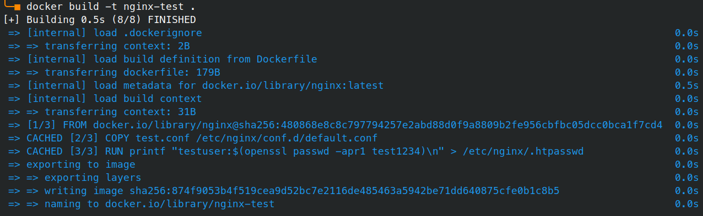
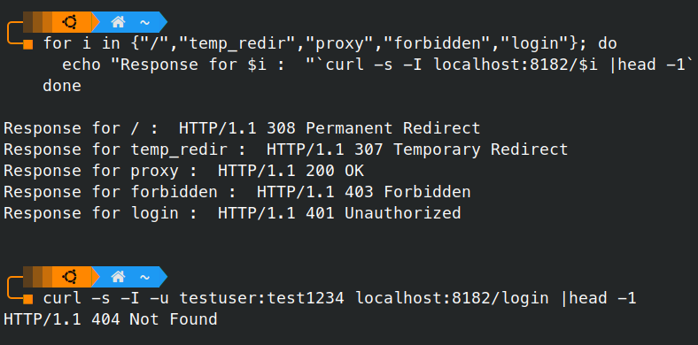

# Docker

## Завдання

Write Dockerfile that prepares your own Nginx-image configured for:

 1. Redirect to medium.com
 2. Redirect to medium.com with another status code
 3. Proxy to whatever you like site from URL/proxy path
 4. Display 4xx from URL/forbidden
 5. Do the basic auth for URL/login
 6. Display the “success” status code
 7. Do load balancing (upstream) with Nginx web server (start two additional servers to balancing)
 8. Provide your Dockerfile and screenshots that demonstrates response pages for items 4, 5, 6 of this task


_Пункт 7 буде продемонстрований у наступних роботах, де буде реалізовуватись розгортання певної інфраструктури із балансуванням._

## Рішення

### Dockerfile
Оскільки усі завдання ідентичні до [третьої роботи](../HW03/README.md), ми використаємо конфігураційний файл nginx з неї (тут він представлений як _test.conf_).

Наш Dockerfile буде виглядати таким чином:

```docker
FROM nginx

COPY test.conf /etc/nginx/conf.d/default.conf

RUN printf "testuser:$(openssl passwd -apr1 test1234)\n" > /etc/nginx/.htpasswd
```
Ми беремо за основу офіційний докер image `nginx`, копіюємо туди наш конфіг на заміну дефолтного, а також певною командою створюємо логін та пароль користувача для авторизації.

### Збірка
```bash
docker build -t nginx-test .
```
<!--
```
[+] Building 0.5s (8/8) FINISHED
 => [internal] load .dockerignore                                                                              0.0s
 => => transferring context: 2B                                                                                0.0s
 => [internal] load build definition from Dockerfile                                                           0.0s
 => => transferring dockerfile: 179B                                                                           0.0s
 => [internal] load metadata for docker.io/library/nginx:latest                                                0.5s
 => [internal] load build context                                                                              0.0s
 => => transferring context: 31B                                                                               0.0s
 => [1/3] FROM docker.io/library/nginx@sha256:480868e8c8c797794257e2abd88d0f9a8809b2fe956cbfbc05dcc0bca1f7cd4  0.0s
 => CACHED [2/3] COPY test.conf /etc/nginx/conf.d/default.conf                                                 0.0s
 => CACHED [3/3] RUN printf "testuser:$(openssl passwd -apr1 test1234)\n" > /etc/nginx/.htpasswd               0.0s
 => exporting to image                                                                                         0.0s
 => => exporting layers                                                                                        0.0s
 => => writing image sha256:874f9053b4f519cea9d52bc7e2116de485463a5942be71dd640875cfe0b1c8b5                   0.0s
 => => naming to docker.io/library/nginx-test                                                                  0.0s
```
-->


### Запуск
```bash
docker run -d -p 8182:80 --name nginx-test nginx-test
```
Ми запустили контейнер _nginx-test_ із зібраного нами імеджа _nginx-test_, порт 80 якого буде доступний на порту 8182 нашої хост машини.

## Тестування

### 1. Опитаємо скриптом усі сконфігуровані локації:
```bash
for i in {"/","temp_redir","proxy","forbidden","login"}; do
  echo "Response for $i :  "`curl -s -I localhost:8182/$i |head -1`
done

Response for / :  HTTP/1.1 308 Permanent Redirect
Response for temp_redir :  HTTP/1.1 307 Temporary Redirect
Response for proxy :  HTTP/1.1 200 OK
Response for forbidden :  HTTP/1.1 403 Forbidden
Response for login :  HTTP/1.1 401 Unauthorized
```

### 2. Перевіримо авторизацію
```bash
curl -s -I -u testuser:test1234 localhost:8182/login |head -1
HTTP/1.1 404 Not Found
```
Отримали `404 Not Found` замість `401 Unauthorized`, отже авторизація пройшла вдало.



---
