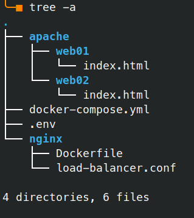
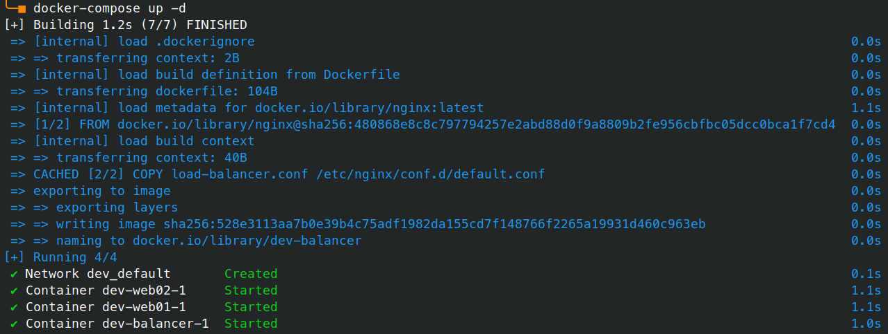
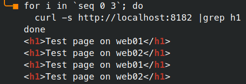

# Docker Compose

## Завдання
1. Write Dockerfile and Docker Compose configuration file that prepare and start Nginx-server with load balancing web server.
2. Provide your Dockerfile, Docker Compose configuration file and screenshots that demonstrate response page of web server.

## Рішення

### docker-compose.yml


Наш Dockerfile буде виглядати таким чином:

```yaml
version: '3.9'
services:
  balancer:
    build:
      context: ./nginx
    ports:
        - 8182:80
  web01:
    image: httpd
    volumes:
        - ./apache/web01:/usr/local/apache2/htdocs
  web02:
    image: httpd
    volumes:
        - ./apache/web02:/usr/local/apache2/htdocs
```

Для побудови образу `nginx` ми використаємо простий Dockerfile, який лише додає конфігураційний файл:
```docker
FROM nginx

COPY load-balancer.conf /etc/nginx/conf.d/default.conf
```

Для контейнерів на базі `apache` ми використаємо опцію `volumes` для монтування локальних каталогів, що містять файл _index.html_.

### Змінні
В файл .env додамо змінну `COMPOSE_PROJECT_NAME=dev`, яка визначить назву нашого проєкту.

В результаті маємо таку структуру файлів:

<!--
```
tree -a
.
├── apache
│   ├── web01
│   │   └── index.html
│   └── web02
│       └── index.html
├── docker-compose.yml
├── .env
└── nginx
    ├── Dockerfile
    └── load-balancer.conf
```
-->


### Збірка та запуск
```bash
docker-compose up -d
```
<!--
```
[+] Building 1.2s (7/7) FINISHED
 => [internal] load .dockerignore                                                                              0.0s
 => => transferring context: 2B                                                                                0.0s
 => [internal] load build definition from Dockerfile                                                           0.0s
 => => transferring dockerfile: 104B                                                                           0.0s
 => [internal] load metadata for docker.io/library/nginx:latest                                                1.1s
 => [1/2] FROM docker.io/library/nginx@sha256:480868e8c8c797794257e2abd88d0f9a8809b2fe956cbfbc05dcc0bca1f7cd4  0.0s
 => [internal] load build context                                                                              0.0s
 => => transferring context: 40B                                                                               0.0s
 => CACHED [2/2] COPY load-balancer.conf /etc/nginx/conf.d/default.conf                                        0.0s
 => exporting to image                                                                                         0.0s
 => => exporting layers                                                                                        0.0s
 => => writing image sha256:528e3113aa7b0e39b4c75adf1982da155cd7f148766f2265a19931d460c963eb                   0.0s
 => => naming to docker.io/library/dev-balancer                                                                0.0s
[+] Running 4/4
 ✔ Network dev_default       Created                                                                           0.1s
 ✔ Container dev-web02-1     Started                                                                           1.1s
 ✔ Container dev-web01-1     Started                                                                           1.1s
 ✔ Container dev-balancer-1  Started                                                                           1.0s
```
-->



## Тестування

Простим циклом зробимо 4 запити до нашого балансувальника:
```bash
for i in `seq 0 3`; do
  curl -s http://localhost:8182 |grep h1
done
```
<!--
```
    <h1>Test page on dev-apache01</h1>
    <h1>Test page on dev-apache02</h1>
    <h1>Test page on dev-apache01</h1>
    <h1>Test page on dev-apache02</h1>
```
-->



Як ми бачимо, балансування працює — з кожним запитом змінюється кінцевий сервер.

---
