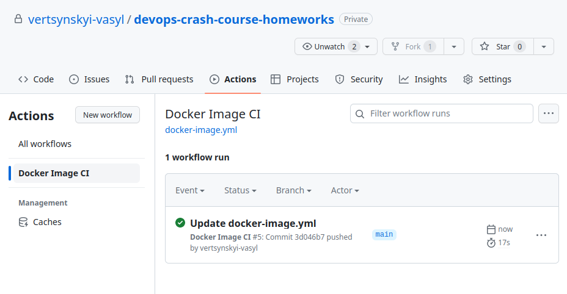

# GitHub Actions

## Завдання
1. Setup your GitHub Actions workflow that builds Docker image from the [homework #6](../HW06/README.md).
2. Provide your link on the repository and screenshots that demonstrates console output of the workflow.

## Хід роботи

### Створення Workflow

Для створення Workflow необхідно лише створити файл сценарію у `.github/workflows` і після збереження зміг процес запуститься автоматично (звісно, якщо це буде прописано у сценарії).

Ось простий сценарі збірки образу:
```yaml
# .github/workflows/docker-image.yml
name: Docker Image CI

on:
  push:
    branches: [ "main" ]
  pull_request:
    branches: [ "main" ]

jobs:
  build:
    runs-on: ubuntu-latest
    steps:
    - uses: actions/checkout@v3
    - name: Build the Docker image
      run: docker build ./HW06 --tag nginx-test-gh:$(date +%s)
```

### Запуск

```bash
git add .
git commit -m "Create docker-image.yml"
git push
```

Через нетривалий проміжок часу на GitHub можна спостерігати успішне виконання процесу



---
