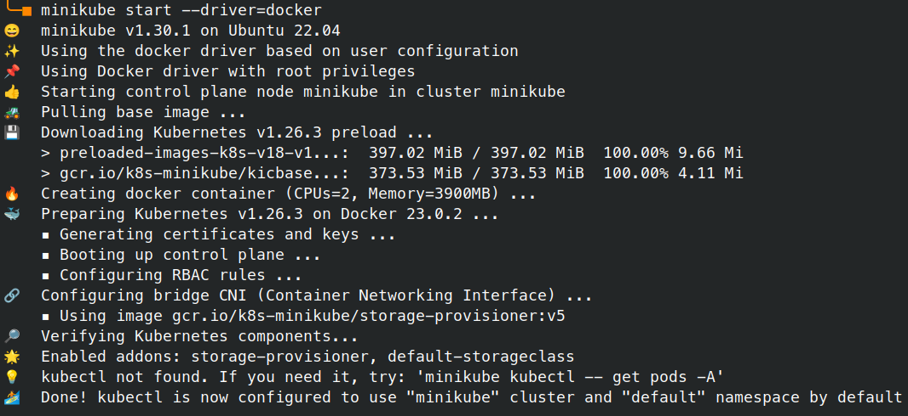

# K8s
## Завдання

1. Using [minikube](https://minikube.sigs.k8s.io/) install your cluster
2. Write Kubernetes configuration file that prepare and start Nginx-server with load balancing web server
3. Provide your Kubernetes configuration file and screenshots that demonstrate response page of web server

## Підготовка
### Інсталяція
Встановлюємо minikube:
```bash
curl -LO https://storage.googleapis.com/minikube/releases/latest/minikube_latest_amd64.deb
sudo dpkg -i minikube_latest_amd64.deb
```
Встановлюємо kubectl:
```bash
minikube kubectl
    > kubectl.sha256:  64 B / 64 B [-------------------------] 100.00% ? p/s 0s
    > kubectl:  45.81 MiB / 45.81 MiB [------------] 100.00% 10.62 MiB p/s 4.5s
```
Додамо alias для kubectl:
```bash
# для bash:
echo 'alias kubectl="minikube kubectl --"' >> ~/.bashrc
source ~/.bashrc
# або для zsh:
echo 'alias kubectl="minikube kubectl --"' >> ~/.zshrc
source ~/.zshrc
```
### Запуск кластера

```bash
minikube start --driver=docker
```


<!--
```
😄  minikube v1.30.1 on Ubuntu 22.04
✨  Using the docker driver based on user configuration
📌  Using Docker driver with root privileges
👍  Starting control plane node minikube in cluster minikube
🚜  Pulling base image ...
💾  Downloading Kubernetes v1.26.3 preload ...
    > preloaded-images-k8s-v18-v1...:  397.02 MiB / 397.02 MiB  100.00% 9.66 Mi
    > gcr.io/k8s-minikube/kicbase...:  373.53 MiB / 373.53 MiB  100.00% 4.11 Mi
🔥  Creating docker container (CPUs=2, Memory=3900MB) ...
🐳  Preparing Kubernetes v1.26.3 on Docker 23.0.2 ...
    ▪ Generating certificates and keys ...
    ▪ Booting up control plane ...
    ▪ Configuring RBAC rules ...
🔗  Configuring bridge CNI (Container Networking Interface) ...
    ▪ Using image gcr.io/k8s-minikube/storage-provisioner:v5
🔎  Verifying Kubernetes components...
🌟  Enabled addons: storage-provisioner, default-storageclass
💡  kubectl not found. If you need it, try: 'minikube kubectl -- get pods -A'
🏄  Done! kubectl is now configured to use "minikube" cluster and "default" namespace by default
```
-->
## Конфігурація

### ConfigMap
ConfigMap дозволяє нам зберігати конфігураційні данні як пари «ключ/значення», тому нам не доведеться монтувати кастомні index.html для кожного сервера.
Нагадаю, ми використовували їх у [роботі #7](../HW07/README.md) для того, щоб перевірити працездатність балансувальника — якщо він справний, то за кожним запитом ми мали бачити різні відповіді:
```bash
cat ../HW07/apache/web01/index.html
```
```html
<!DOCTYPE html>
<html lang="en">
<body>
    <h1>Test page on web01</h1>
</body>
</html>
```
```bash
cat ../HW07/apache/web02/index.html
```
```html
<!DOCTYPE html>
<html lang="en">
<body>
    <h1>Test page on web02</h1>
</body>
</html>
```

Створимо такі пари із цих файлів
```bash
kubectl create configmap web01-index-html --from-file=index.html=../HW07/apache/web01/index.html
kubectl create configmap web02-index-html --from-file=index.html=../HW07/apache/web02/index.html
```
Можемо переглянути як виглядає створений configmap у форматі yaml:
```bash
kubectl get cm web01-index-html -o yaml
```
```yaml
apiVersion: v1
data:
  index.html: |
    <!DOCTYPE html>
    <html lang="en">
    <body>
        <h1>Test page on web01</h1>
    </body>
    </html>
kind: ConfigMap
metadata:
  creationTimestamp: "2023-05-14T17:42:29Z"
  name: web01-index-html
  namespace: default
  resourceVersion: "622"
  uid: 66db03f6-4d18-4f47-b952-5f33f4c35ecc
```

### Веб сервери

Створимо конфігурацію для нашого веб северу — файл web01.yml з таким вмістом:

```yaml
apiVersion: apps/v1
kind: Deployment
metadata:
  name: web01
spec:
  replicas: 2
  selector:
    matchLabels:
      app: apache
      group: shared
  template:
    metadata:
      labels:
        app: apache
        group: shared
    spec:
      containers:
      - name: apache
        image: httpd
        ports:
        - containerPort: 80
        volumeMounts:
        - name: html
          mountPath: /usr/local/apache2/htdocs
      volumes:
      - name: html
        configMap:
          name: web01-index-html
```

Таким самим чином створимо конфігурацію і для другого веб серверу, замінивши `web01` на `web02`:
```bash
cat web01.yml | sed 's/web01/web02/g' > web02.yml
```

### Балансувальник

Створимо файл `balancer.yml` з таким вмістом:
```yaml
apiVersion: v1
kind: Service
metadata:
  name: balancer
spec:
  selector:
    app: apache
    group: shared
  ports:
    - protocol: TCP
      port: 80
      targetPort: 80
  type: LoadBalancer
```

## Запуск

Створимо сконфігуровані ресурси, виконавши команди:
```bash
kubectl apply -f web01.yml
kubectl apply -f web02.yml
kubectl apply -f balancer.yml
```

Переглянемо створені ресурси:
```bash
kubectl get services

NAME         TYPE           CLUSTER-IP       EXTERNAL-IP   PORT(S)        AGE
balancer     LoadBalancer   10.108.115.184   <pending>     80:30971/TCP   1h
kubernetes   ClusterIP      10.96.0.1        <none>        443/TCP        1h


kubectl get deployments
NAME    READY   UP-TO-DATE   AVAILABLE   AGE
web01   2/2     2            2           1h
web02   2/2     2            2           1h

kubectl get pods
NAME                     READY   STATUS    RESTARTS      AGE
web01-677db8678d-kll6g   1/1     Running   1 (23m ago)   1h
web01-677db8678d-rsm57   1/1     Running   1 (23m ago)   1h
web02-79456fbdc-qpvdm    1/1     Running   1 (23m ago)   1h
web02-79456fbdc-vvxjj    1/1     Running   1 (23m ago)   1h
```


## Tестування
Якщо ви звернули увагу, то наш сервір `balancer` має статус зовнішньої адреси — _pending_.
```bash
kubectl get svc balancer
NAME       TYPE           CLUSTER-IP       EXTERNAL-IP   PORT(S)        AGE
balancer   LoadBalancer   10.108.115.184   <pending>     80:30971/TCP   1h
```

Найшвидший шлях зробити доступним наш балансер, це виконати команду:
```bash
minikube tunnel
Status:
        machine: minikube
        pid: 538370
        route: 10.96.0.0/12 -> 192.168.49.2
        minikube: Running
        services: [balancer]
    errors: 
                minikube: no errors
                router: no errors
                loadbalancer emulator: no errors
```
_* тунель працює доки ця команда виконується_


Перевіримо статус:
```bash
kubectl get svc balancer
NAME       TYPE           CLUSTER-IP       EXTERNAL-IP      PORT(S)        AGE
balancer   LoadBalancer   10.108.115.184   10.108.115.184   80:30971/TCP   1h
```
Бачимо, що з’явилась зовнішня ip адреса.

Тепер перевіримо чи працює балансування:
```bash
for i in `seq 0 3`; do
      curl -s 10.108.115.184 |grep h1
    done
    <h1>Test page on web01</h1>
    <h1>Test page on web02</h1>
    <h1>Test page on web01</h1>
    <h1>Test page on web02</h1>
```

Як ми бачимо, балансування працює — з кожним запитом змінюється кінцевий сервер.
