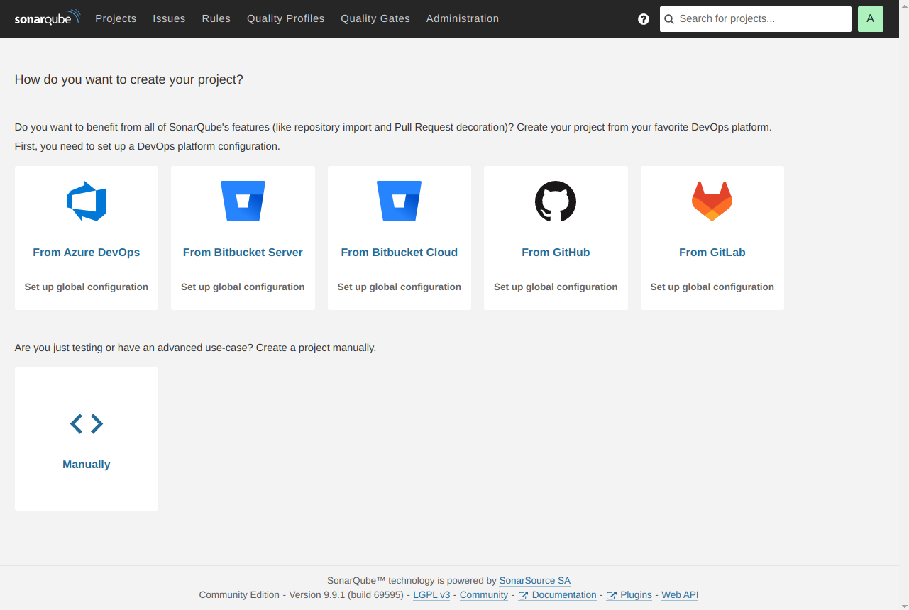
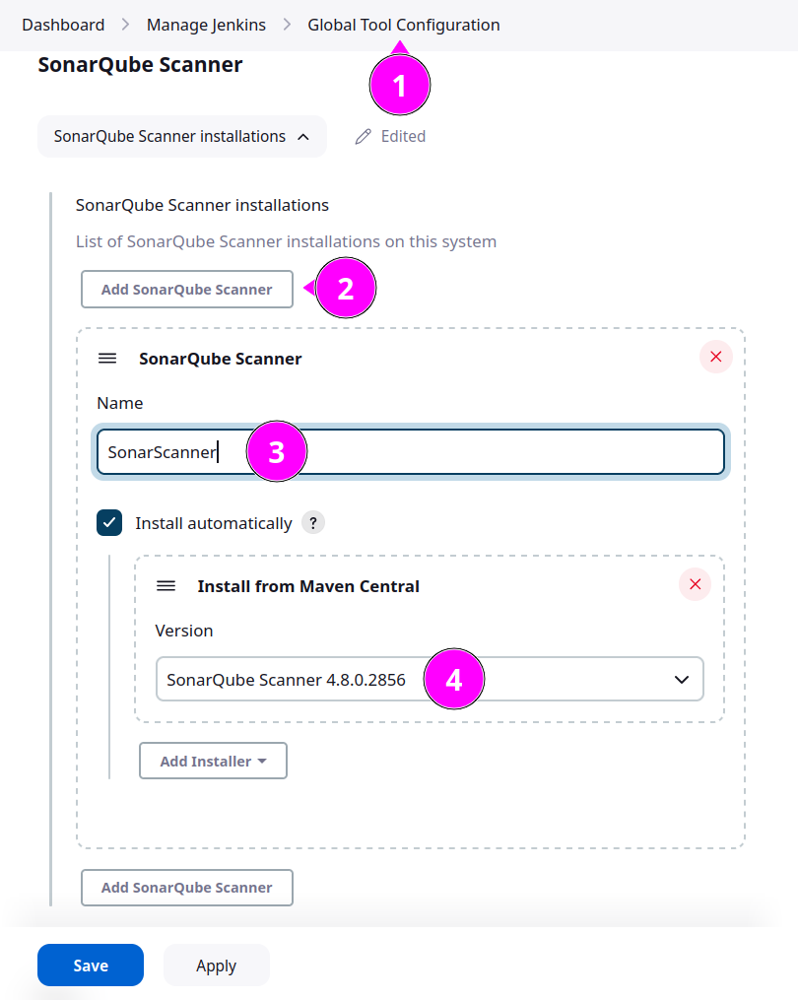
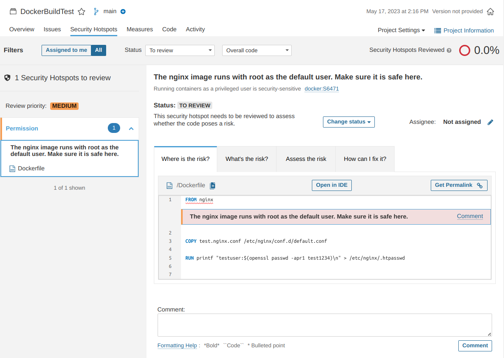

# Clouds

## Завдання

1. Create account on any cloud provider, of your choosing: AWS, Azure, GPC
2. Create VM that provider offeres in free tier
3. Install there SonarQube Community Edition application (https://www.sonarsource.com/)
4. Provide your screenshots that demonstrate the application working in cloud

Схема, яку планується розгорнути у клауді:
* Застосунок: EC2 instance (ami Ubuntu 22.04)
* База даних: RDS (Postgres)
* Балансувальник: ELB _// Оскільки конфігурація дозволяє використовувати різні AZ //_


_Бонус програма: Окрім того, що ми розгорнемо SonarQube, ми також створимо простий Pipeline у Jenkins з його участю._


## AWS

### Підготовка 
За основу я взяв репозиторій [Michal Štefanec](https://github.com/stefiix92/sonarqube-aws-terraform). Більшість коду Terraform оригінальна, я трохи його підчистив та додав призначення тегів за замовчуванням для зручності керування ресурсами. А ось сам скрипт розгортання застосунку довелося майже повністю переробити, він виявився неактуальним і містив деякі незрозумілі речі.

Структура файлів виглядає таким чином:
```bash
tree
.
├── compute
│   ├── main.tf
│   ├── outputs.tf
│   └── variables.tf
├── database
│   ├── main.tf
│   ├── outputs.tf
│   └── variables.tf
├── last.tfplan
├── LICENSE
├── loadbalancing
│   ├── main.tf
│   ├── outputs.tf
│   └── variables.tf
├── locals.tf
├── main.tf
├── networking
│   ├── main.tf
│   ├── outputs.tf
│   └── variables.tf
├── outputs.tf
├── providers.tf
├── terraform.tfvars
├── userdata.tpl
└── variables.tf
```
Файл `terraform.tfvars` не має бути у репозиторії, проте я залишив його тут для наглядності. Даних у ньому достатньо для успішного запуску.
```ini
# --- root/terraform.tfvars ---

access_ip       = "0.0.0.0/0"
public_key_path = "~/.ssh/keys/Terraform.pub"

### DATABASE VARIABLES ###
db_name     = "sonarqube"
db_user     = "master"
db_password = "bQt1Ge7oaXI0pQgioNFE"

### SONARQUBE VARIABLES ###
server_user_password = "fo2RbQcLOabNvfxH"
```
Також потрібно переконатися, що ви маєте актуальні дані для підключення до AWS, які за замовчанням розташовані у `~/.aws/credentials`.
```ini
[default]
aws_access_key_id = RX7SHRJRJHQYDNBSBUBB
aws_secret_access_key = etFdov3uWOazBKXjYF4MSO4FUcfe94lHoqCQvMNy
```

### Розгортання

Запускаємо розгортання командою `terraform apply` і терпляче чекаємо на закінчення процесу.

В результаті маємо отримати повідомлення про успішно створені ресурси, а також посилання на базу даних, балансувальник і ip адресу нашої машини із застосунком.


**TODO:**
_При першому запуску виникає помилка, яка лікується повторним запуском:_
```log
│ Error: Provider produced inconsistent final plan
│
│ When expanding the plan for module.networking.aws_vpc.sonarqube_vpc to include new values learned so far during apply, provider
│ "registry.terraform.io/hashicorp/aws" produced an invalid new value for .tags_all: new element "Name" has appeared.
│
│ This is a bug in the provider, which should be reported in the provider's own issue tracker.
```

Отримані вихідні дані: _database_endpoint_, _dns_name_ та _instance_endpoint_ нам знадобляться у подальші роботі, а також для вирішення проблем, якщо такі виникнуть. Варто їх собі десь зберегти, якщо щось трапиться із файлом `terraform.tfstate`, в якому вони знаходяться.
До речі, їх можна швидко отримати з нього командою:
```bash
jq .outputs terraform.tfstate
```

### Перевірка

Переглянемо список створених ресурсів за тегами:
```bash
aws resourcegroupstaggingapi get-resources --output json --no-cli-pager \
    --tag-filters "Key=Environment,Values=Test" "Key=Service,Values=Sonarqube" |\
    jq '.ResourceTagMappingList[].ResourceARN' | sort
```
```log
"arn:aws:ec2:eu-central-1:xXxXxXxXxXxX:instance/i-05448fe37e8ff1b9a"
"arn:aws:ec2:eu-central-1:xXxXxXxXxXxX:internet-gateway/igw-0abf1bc4244c94e63"
"arn:aws:ec2:eu-central-1:xXxXxXxXxXxX:key-pair/key-0847cefe8acb5f505"
"arn:aws:ec2:eu-central-1:xXxXxXxXxXxX:route-table/rtb-0ab6b6dbc06cf44e8"
"arn:aws:ec2:eu-central-1:xXxXxXxXxXxX:route-table/rtb-0f7512eaaa3a76df8"
"arn:aws:ec2:eu-central-1:xXxXxXxXxXxX:security-group/sg-05a2c4f1b2925d714"
"arn:aws:ec2:eu-central-1:xXxXxXxXxXxX:security-group/sg-07729ae9490f328fe"
"arn:aws:ec2:eu-central-1:xXxXxXxXxXxX:subnet/subnet-0490d991737323a5d"
"arn:aws:ec2:eu-central-1:xXxXxXxXxXxX:subnet/subnet-08ed6b969c1a5d5d4"
"arn:aws:ec2:eu-central-1:xXxXxXxXxXxX:subnet/subnet-0921e24c1bd225786"
"arn:aws:ec2:eu-central-1:xXxXxXxXxXxX:subnet/subnet-0a92904ff0591c828"
"arn:aws:ec2:eu-central-1:xXxXxXxXxXxX:subnet/subnet-0f1f79d14fde090b6"
"arn:aws:ec2:eu-central-1:xXxXxXxXxXxX:vpc/vpc-06fe4307e00b0a840"
"arn:aws:elasticloadbalancing:eu-central-1:xXxXxXxXxXxX:listener/app/sonarqube-loadbalancer/5aa32f560847aab4/9ba22ffcd0e8037a"
"arn:aws:elasticloadbalancing:eu-central-1:xXxXxXxXxXxX:loadbalancer/app/sonarqube-loadbalancer/5aa32f560847aab4"
"arn:aws:elasticloadbalancing:eu-central-1:xXxXxXxXxXxX:targetgroup/sonarqube-lb-tg-2d6/3a52a8b4314759d0"
"arn:aws:rds:eu-central-1:xXxXxXxXxXxX:db:sonarqube-db"
"arn:aws:rds:eu-central-1:xXxXxXxXxXxX:subgrp:sonarqube_rds_subnetgroup"
```
Усі ресурси відповідно до нашої конфігурації створені успішно.

## SonarQube

### Перший запуск

Перейдемо за посиланням на балансувальник (значення _dns_name_ із _Outputs_, у моєму випадку це: _http://sonarqube-loadbalancer-1065261622.eu-central-1.elb.amazonaws.com_)


На сторінці входи введемо дані для входу за замовчанням: `admin` / `admin` і на наступній сторінці змінимо пароль на більш надійний:


Тепер SonarQube готовий до роботи.




### Створення проєкту

Обираємо створення проєкта вручну (_Manually_).


У діалозі _Create a project_ просто вводимо назву нашого проєкту (_DockerBuildTest_) та натискаємо _Set Up_. Цю назву ми будемо використовувати для зв’язку із Jenkins.


_На наступній сторінці рекомендую ознайомитись із міні тюторіалами щодо налаштування різних CI систем_

### Створення токену

Тепер створимо токен для доступу (у нашому випадку для доступу із Jenkins).
Перейдемо по шляху: _User > My Account > Security_
Задамо токену назву, тип, визначимо його строк дії і натиснемо _Generate_.


На наступному етапі скопіюємо токен (раджу поки що не закривати це вікно, доки ми не додамо цей токен у Jenkins).


http://localhost:8989/manage/credentials/store/system/domain/_/

## Jenkins

### Додавання токену

Токен додається у тому ж розділі, де ми додавали ключ SSH для доступу до агентів.
Тож переходимо шляхом _Dashboard > Manage Jenkins > Credentials > System > [Global credentials (unrestricted)](http://localhost:8989/manage/credentials/store/system/domain/_/)_ та натискаємо ***+ Add Credentials***


**Тип** (Kind)  обираємо як _Secret text_, у поле **Secret** вставляємо токен, який ми скопіювали у SonarQube і в **ID** напишемо _sonar-token_ (цей ID має нам допомогти розрізняти токени, коли їх стане багато).
Врешті тиснемо ***Create***.


Токен додано успішно.


### Встановлення плагіну SonarQube Scanner for Jenkins

#### Установка
Переходимо у _Dashboard > Manage Jenkins > Plugin Manager > [Available plugins](http://localhost:8989/manage/pluginManager/available)_

Знаходимо за ключовим словом "sonar" плагін із назвою _SonarQube Scanner for Jenkins_, встановлюємо його та перезапускаємо Jenkins.


#### SonarQube server

Для налаштування плагіну переходимо у _Dashboard > Manage Jenkins > [Configure System](http://localhost:8989/manage/configure)_, шукаємо розділ **SonarQube servers** та натискаємо ***Add SonarQube***


Задаємо назву, вказуємо URL нашого балансувальника (важливо вказати протокол http://, інакше виникне помилка), обираємо доданий раніше токен та тиснемо ***Save***.


#### SonarQube scanner

Переходимо у _Dashboard > Manage Jenkins > [Global Tool Configuration](http://localhost:8989/manage/configureTools/)_, шукаємо розділ **SonarQube Scanner** та натискаємо ***Add SonarQube Scanner***.

Даємо назву (!уважно, ця назва буде використану у Pipeline'і), відзначаємо _Install automatically_ та обираємо версію нашого сканера, яка буде встановлена із репозиторія Maven (я обрав найсвіжішу).
Зберігаємо налаштування.




## Git

Використаємо Git-репозиторій із [восьмої роботи](../HW08/README.md#git)

```bash
git clone http://10.17.3.1:9000/hw08.git
cd hw08.git
```

Перед тим, як вносити зміни, зробимо окрему гілку _sonarqube_:

```bash
git checkout -b sonarqube
```

Додамо файл налаштувань SonarQube, в якому вкажемо назву нашого проєкту:
```bash
echo "sonar.projectKey=DockerBuildTest" > sonar-project.properties
```

Замінимо вміст Jenkinsfile на такий:
```groovy
node {
  stage('SCM') {
    checkout scm
  }
  stage('SonarQube Analysis') {
    def scannerHome = tool 'SonarScanner';
    withSonarQubeEnv() {
      sh "${scannerHome}/bin/sonar-scanner"
    }
  }
}
```
Це простий конвеєр, який буде лише перевіряти код за допомогою SonarQube.

Швидко замінити можна таким чином:
```bash
cat << EOF > Jenkinsfile
node {
  stage('SCM') {
    checkout scm
  }
  stage('SonarQube Analysis') {
    def scannerHome = tool 'SonarScanner';
    withSonarQubeEnv() {
      sh "\${scannerHome}/bin/sonar-scanner"
    }
  }
}
EOF
```

Маємо таку структуру нашого Git:
```bash
tree
.
├── Dockerfile
├── Jenkinsfile
├── sonar-project.properties
└── test.nginx.conf
```


Запишемо зміни та оновимо репозиторій.
```bash
git add .
git commit -m "Add SonarQube Analysis"
git push -u origin sonarqube
```
Тепер ми маємо на нашому сервері Git гілку із назвою _sonarqube_, яка містить файл сценарію для SonarQube.
Залишилось лише створити конвеєр Jenkins.

## Pipeline

Створюємо у Jenkins простий конвеєр типу: «все що треба є у Git», з назвою, наприклад, _BuildDockerImage_CodeTesting_.


Робимо всі налаштування, як у [попередній роботі](../HW08/README.md#pipeline-job), з єдиною відміною — гілку вказуємо як _sonarqube_ замість _master_.


Запускаємо завдання, та спостерігаємо за результатом:


Все пройшло успішно, тепер можна перейти до SonarQube і переглянути результати там.

Бачимо, що з’явились результати перевірки нашого коду:


Можемо переглянути знайдений Security Hotspot



Тут SonarQube нам підказує, що ми маємо переконатися, що запуск сервісу `nginx` від користувача root є безпечним у нашій конфігурації.
Дуже корисне зауваження.


## Висновки

Ми досягли поставлених цілей: розгорнули застосунок SonarQube з використанням хмарного провайдеру AWS, а також долучили його до роботи із нашими Jenkins Pipelines.

В подальшому ми можемо додати процес перевірки якості кода як один із етапів збірки, який, наприклад, буде блокувати завантаження зібраного образу, якщо якість коду не буде задовольняти заданим параметрам.

