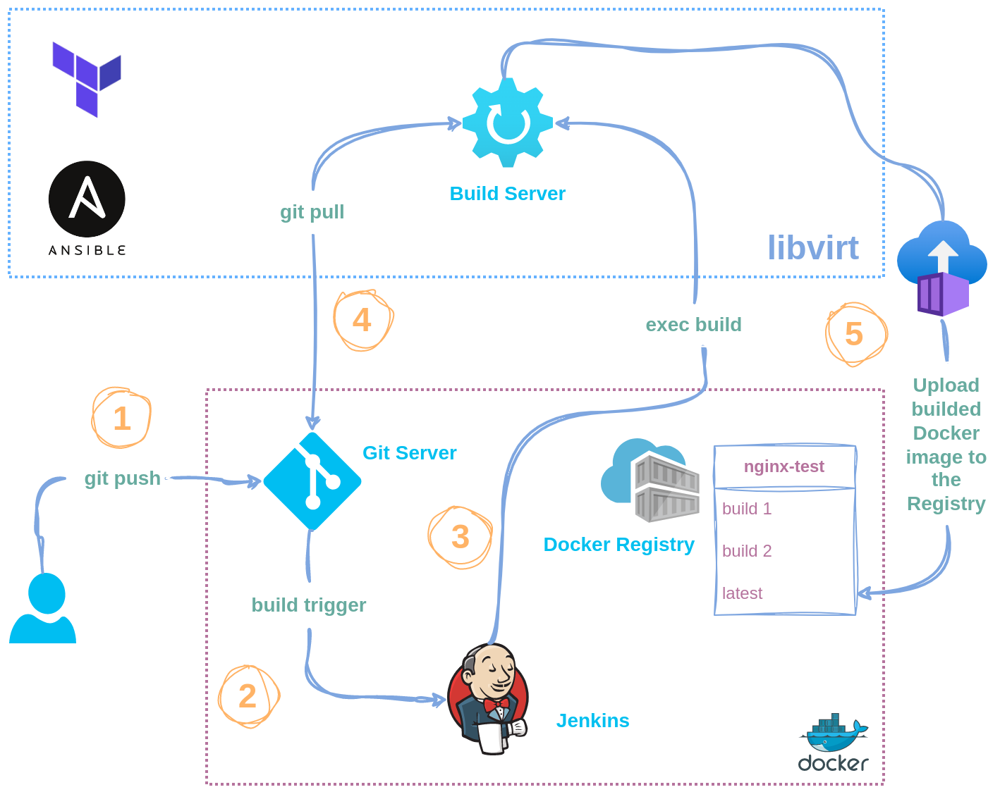

# DevOps Crash Course

---

## Table of content
### [1. Vagrant](./HW01/README.md)
### [2. Git/GitHub](./HW02/README.md)
### [3. Web](./HW03/README.md)
### [4. Terraform](./HW04/README.md)
### [5. Ansible](./HW05/README.md)
### [6. Docker](./HW06/README.md)
### [7. Docker Compose](./HW07/README.md)
### [8. Jenkins](./HW08/README.md)
### [9. GitHub Actions](./HW09/README.md)
### [10. K8s](./HW10/README.md)
### [11. Clouds](./HW11/README.md)
### [Final Work](./FinalWork/README.md)

---

### Обрана робота: [Final Work](./FinalWork/README.md)
_//описує застосування більшості з розглянутих технологій//_

